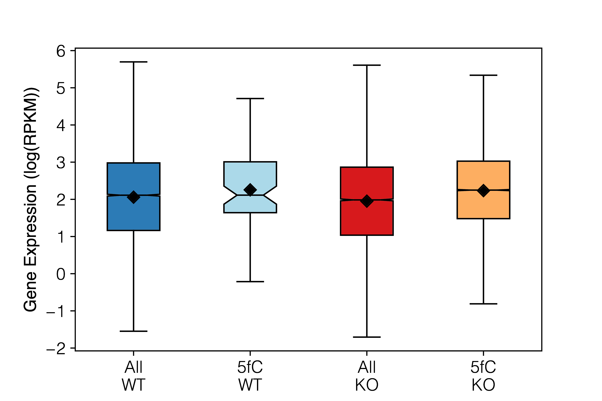
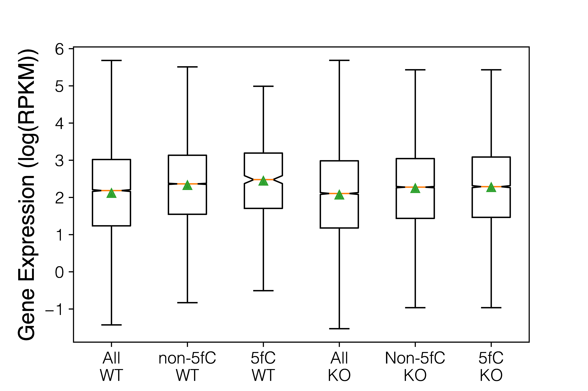
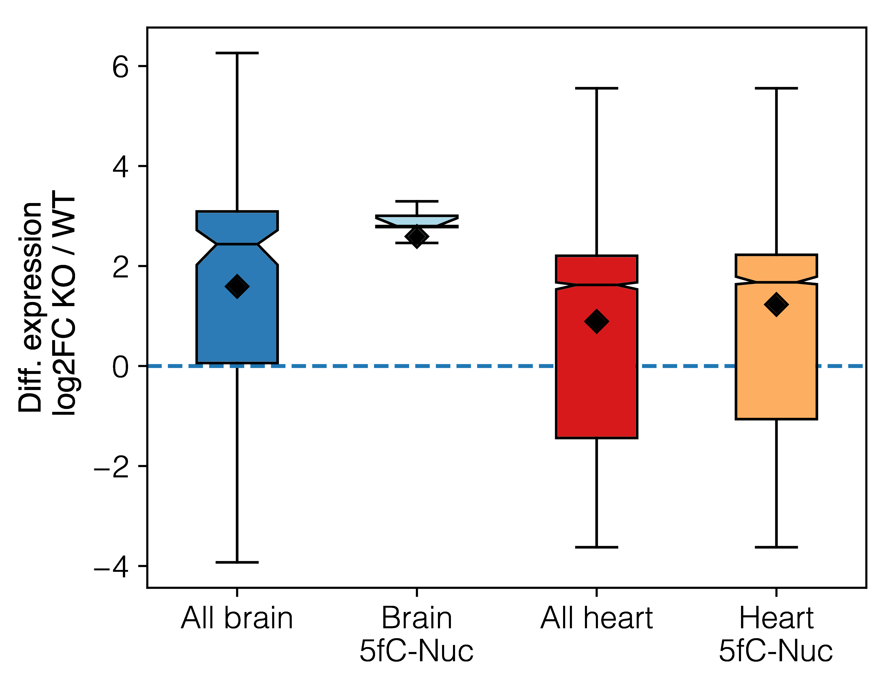
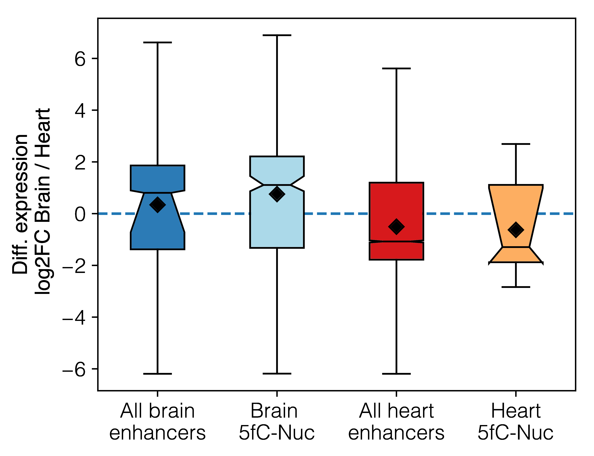
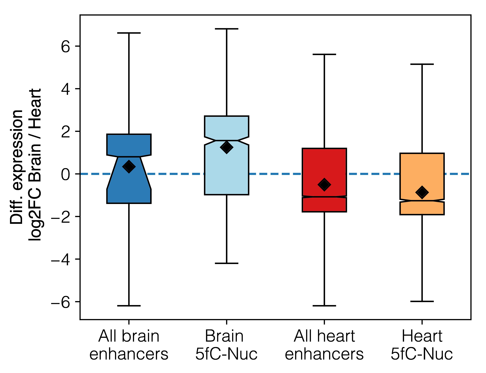

## Enhancers-DE in 5fC-related nucleosomes Heart vs brain

This section requires the results from these analysis,

-   [Differential gene expression](20170703_RNAseq_heart_brain/README.md)
-   Nucleosome positioning
-   5fC data

```bash
cd ~/Dropbox/work/Projects/Euni_fc/5fc_nucleosome/nucleosome_diff_positions_vs_5fC_heart_vs_brain
```

In general, these are the number of DE genes across tissues/conditions. This
comes directly from RNA-seq.

| what                       | N of genes |
| -------------------------- | :--------: |
| DE genes Brain KO_vs_WT    |     87     |
| DE genes Heart KO_vs_WT    |     188    |
| DE genes Brain vs Heart WT |    4036    |
| DE genes Brain vs Heart KO |    3100    |

## Differential expression KO vs WT in each tissue

We have processed the data using [this](scripts/WT_vs_TDG_KO_DE_in_heart_and_brain.ipynb) notebook.

## Differential expression between heart/hindbrain tissues, in WT and TDG-KO

We have processed the data using [this](scripts/brain_vs_heart_DE_via_RenLab_enhancers.ipynb) notebook.

----

Number of overlapping enhancer with 5fC-Nuc / not-5fC-Nuc, not considering gene
expression.

| who                 | N overlaps |
| ------------------- | :--------: |
| Heart nuc5fC WT     |     100    |
| Heart nuc5fC KO     |    32449   |
| Heart NOT nuc5fC WT |    48084   |
| Heart NOT nuc5fC KO |    28944   |

| who                 | N overlaps |
| ------------------- | :--------: |
| Brain nuc5fC WT     |     593    |
| Brain nuc5fC KO     |    11798   |
| Brain NOT nuc5fC WT |    35068   |
| Brain NOT nuc5fC KO |    26251   |

Number of differentially expressed genes (KO vs WT) that contain
5fC-Nuc overlaps, in each tissue

| who    (KO vs WT) | number of unique genes |
| ----------------- | :--------------------: |
| Brain DE 5fC-nuc  |           15           |
| Heart DE 5fC-nuc  |           50           |

Since there are more enhancer sites than genes, the same gene
could be affected by a number of diff enhancers. Here's the non-unique
number of DE genes overlapping with 5fC-Nuc.

| who  (KO vs WT)  | number of non-unique genes |
| ---------------- | :------------------------: |
| Brain DE 5fC-nuc |             40             |
| Heart DE 5fC-nuc |             217            |

#### Gene expression

##### Heart log GE WT and KO in 5fC-Nuc, and controls



##### Heart log GE WT and KO in 5fC-Nuc, and controls



### Differential gene expression KO vs WT in each tissue



## Differential expression across tissues

| TDG | Total number of DE |
| --- | :----------------: |
| WT  |        4036        |
| KO  |        3100        |

Number of DE genes associated to 5fC-Nuc in each TDG condition,

| who  (Brain vs Heart) WT | number of unique genes |
| ------------------------ | :--------------------: |
| Brain                    |           154          |
| Heart                    |           14           |

| who  (Brain vs Heart) KO | number of unique genes |
| ------------------------ | :--------------------: |
| Brain                    |           422          |
| Heart                    |           761          |

### Differential gene expression brain vs heart in KO or WT

#### For WT



#### For KO


