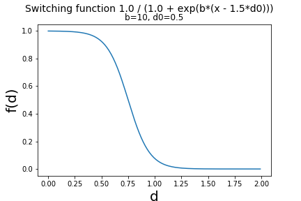

# Position of nucleosome phase based on polymerase stop experiments for 5fC

Polymerase stop experiments upon 5fC-nucleosome ligation can give information on the actual positioning of the 5fC around the histone core. The cross-linking takes place between the formyl of the 5fC and the lysines.

The idea is to compute a probability map of sorts, indicating which bases along the Widom sequence would be close to a lysine, aiding the identification of cross-linking lysines.

## Base-pair--Lys interaction likelyhood

From a set of molecular dynamics trajectories of dinucleosome system, we first split the trajectory into individual nucleosomes, concatenate these individual trajectories, and compute the probability to find potential 5fC-lys contacts.

### Prepare the MD trajectories

The all-atoms simulations are akin to those published in Collepardo et al. JACS 2015 paper. The manuscript containts all the relevant information to replicate these simulations. 

I concatenated all the dinucleosome simulations (internuc distance 6 and 7.5, replicates 1 and 2) into one large trajectory. In one case I had to remove the ions, as they were still there. The trajectories had been previously imaged. I used `-skip 10` to reduce further the number of frames.

To reduce the overhead of writing a code to deal with dinucleosomes, and since the sequences are exactly the same, I will split the trajectory into two nucleosomes.


```bash
#! /usr/bin/env bash

source ~/work/soft/GMX_2016_2/bin/GMXRC.bash

traj_folder=`pwd`/'concat_traj'
pdb_file=${traj_folder}/'init_novsites_dinuc.pdb'
xtc_file=${traj_folder}/'all_concat_novistes_dinuc.xtc'


echo 'chain A or chain B or chain C or chain D or chain E or chain F or chain G or chain H or chain I or chain J
chain K or chain L or chain M or chain N or chain O or chain P or chain Q or chain R or chain S or chain T
name 13 chains_A_to_J
name 14 chains_K_to_T
q' > kk

gmx  make_ndx -f ${pdb_file}  -o  index_split.ndx < kk && rm kk

echo 13 | gmx editconf -f ${pdb_file} -o first_nuc.pdb -n index_split.ndx -resnr 1

echo 13 | gmx trjconv -f ${xtc_file} -o first.xtc -n index_split.ndx
echo 14 | gmx trjconv -f ${xtc_file} -o second.xtc -n index_split.ndx

# Concatenate and fix time step (cosmetic)
gmx trjcat -f first.xtc second.xtc -cat -o concat.xtc &&
gmx trjconv -f concat.xtc -tu ns -timestep 2 -o concatenated_dinuc.xtc &&
rm -fr concat.xtc first.xtc second.xtc

echo ' chain A or chain B
q ' > k
echo 13 | gmx make_ndx  -f first_nuc.pdb -o index_fitting.ndx < k && rm k
echo 13 0  |  gmx trjconv -f concatenated_dinuc.xtc -n index_fitting.ndx -s first_nuc.pdb -o concat_dinuc_fit.xtc -fit rot+trans &&
rm concatenated_dinuc.k first_nuc.pdb second_nuc.pdb second.pdb index_split.ndx index_fitting.ndx
rm -fr \#*
```

### Finding contact distances

I wrote a [python code](scripts/build_bp_lys_contacts.py) to compute the closest lysines to each possible nucleotide in a nucleosome. Check the header of the `.py` files for dependencies. From the MD trajectory above, I centered the distance calculation to the position that the 5-formyl group would adopt, given that that residue was a C. Then I keep a list of dictionaries for each base pair position (1 to 147 for both strands). Each element in the list is a dictionary that stores the time-averaged contact with those lysines that are less than a cutoff (set to 1.2nm). The contacts are made continuous via a switching function (saturation-like curve) such that anything below 0.5nm gives a value of 1, and anything above that decays to 0 (at ~1 nm is almost zero).

```python
%matplotlib inline
import matplotlib.pyplot as plt
import math
import numpy as np

def switch2(b, d0, x):
    return 1.0 / (1 + math.exp(b*(x - 1.5*d0)))

p = np.arange(0, 2, 0.01)
s = np.zeros(200)
for i in range(200):
    s[i] = switch2(10, 0.5, float(i)/100)

fig = plt.figure()
fig.suptitle('Switching function 1.0 / (1.0 + exp(b*(x - 1.5*d0))) ', fontsize=14)
plt.title("b=10, d0=0.5")
plt.ylabel("f(d)", fontsize=20)
plt.xlabel("d", fontsize=20)
plt.plot(p, s)
plt.savefig("switch_function.png")
```



The keys of the dictionary are the residue number of each lysine, and the values are the time-averaged contacts. The code also computes the phase profile along the nucleosome, to get and indicator of which groove is facing the core. The way the phase is defined now is the angle (in rad) between a vector pointing outwards from the center of mass of a base pair \[actually the N1 of the pyr] towards the minor groove. So a small "phase" value associated with a given base pair indicates that the minor groove is facing the histone core.

A second code (`read_bp_list_and_plot.py`) takes care to plot the data contained as a pickled file written by `build_bp_lys_contacts.py`.

The codes are here, and should have a decent documentation inside.

```bash
/Users/guillem/work/Projects/Euni_fc/5fc_nucleosome/polymerase_stop/modelling/build_bp_lys_contacts.py
/Users/guillem/work/Projects/Euni_fc/5fc_nucleosome/polymerase_stop/modelling/read_bp_list_and_plot.py
```

With `./XXX.py -h` you get the options. A typical executions would go like this,

```bash
#! /usr/bin/env bash

# one with the tails; takes long
./build_bp_lys_contacts.py -f concat_dinuc_fit.xtc -s first_nuc_res.pdb -st 4252 -ol list_bp_lys_dict_tails.pkl

# one without the tails
./build_bp_lys_contacts.py -f concat_dinuc_fit.xtc -s first_nuc_res.pdb -st 4252 -notails -ol list_bp_lys_dict_notails.pkl
```

## Analysis including new data set (fwd and reverse strands)

We now have both strands, plus controls. The control in case of 5fC crosslinked against the histones is the experiment done without the crosslinking.

In the new [datasets](data), there are two replicates for 5fC ("fC6" and "fC14"), and two replicates for the control ("ctrl2" and "ctrl25"). The ideas is to average both replicates for 5fC and control, and compute the log2 or their ratio. Then feed the data together with my previous analysis on the DNA-lys contacts.

Using [do_process_fwd_rev_data.py](scripts/do_process_fwd_rev_data.py). In my laptop,

```bash
cd ~/Dropbox/work/Projects/Euni_fc/5fc_nucleosome/polymerase_stop_modelling/modelling

exe_f=~/work/repos/sblab_projects/projects/20151125_5fC_nucleosome/20170130_polymerase_stop_modelling/scripts/do_process_fwd_rev_data.py
${exe_f} -fwd 20170315_table_forward.txt -rev 20170315_table_reverse.txt -o poly_stop

# add the data to the plot

exe_f=~/work/repos/sblab_projects/projects/20151125_5fC_nucleosome/20170130_polymerase_stop_modelling/scripts/read_bp_list_and_plot.py
#no tails
${exe_f} -s first_nuc_res.pdb -lys list_bp_lys_dict_notails.pkl  -phase bp_phase_profile.txt -exp poly_stop_fwd.dat poly_stop_rev.dat -o lys_contact_map_notails
# tails
${exe_f} -s first_nuc_res.pdb -lys list_bp_lys_dict_tails.pkl  -phase bp_phase_profile.txt -o lys_contact_map_tails -exp poly_stop_fwd.dat poly_stop_rev.dat
```

Without the histone tails,


With the histone tails,


**Note that the y-axis is actually a different measurement in each cases, this is just for exploratory visualization.**

# Overlap analysis between polstop data and simulations

Used [read_bp_list_process_likelihood.py](scripts/read_bp_list_process_likelihood.py), e.g.,

```bash
exe_f=~/work/repos/sblab_projects/projects/20151125_5fC_nucleosome/20170130_polymerase_stop_modelling/scripts/read_bp_list_process_likelihood.py
cd ~/Dropbox/work/Projects/Euni_fc/5fc_nucleosome/polymerase_stop_modelling/modelling
${exe_f} -s first_nuc_res.pdb -lys list_bp_lys_dict_tails.pkl  -phase bp_phase_profile.txt -exp poly_stop_fwd.dat poly_stop_rev.dat  -seq widom601.fa
```

After analysis of the data, here a table linking nucleotide positions with lysine residues. The phase indicates minor groove (negative) and major groove (positive).

Combining modelling high-probabilty regions with polstop high-stop regions (product)

| DNA res.  | Near K res. | Phase [-1,1] | Histone | Hist. tail? |
| --------- | ----------- | ------------ | ------- | ----------- |
| 41        | 505 (0.35)  | 0.71         | H4_1    | -           |
| 46        | 1157 (0.18) | -0.83        | H2b_2   | Yes         |
| 61        | 459 (0.62)  | 0.37         | H4_1    | -           |
| 63        | 459 (0.58)  | 0.88         | H4_1    | -           |
| 71        | 895 (0.30)  | 0.29         | H3_2    | -           |
| 81        | 946 (0.27)  | 0.22         | H4_2    | -           |
| 91        | 844 (0.45)  | 0.03         | H3_2    | -           |
| 92        | 844 (0.63)  | 0.40         | H3_2    | -           |
| 95        | 931 (0.04)  | 0.69         | H4_2    | Yes         |
| 143       | 1143 (0.18) | -0.31        | H2a_2   | -           |
| 143       | 1143 (0.18) | -0.31        | H2a_2   | -           |
| 193 (46)  | 683 (0.29)  | -0.83        | H2b_1   | Yes         |
| 216 (69)  | 648 (0.14)  | -0.51        | H2a_1   | -           |
| 220 (73)  | 408 (0.55)  | 0.95         | H3_1    | -           |
| 228 (81)  | 459 (0.28)  | 0.22         | H4_1    | -           |
| 238 (91)  | 357 (0.41)  | 0.03         | H3_1    | -           |
| 238 (91)  | 357 (0.41)  | 0.03         | H3_1    | -           |
| 264 (117) | 660 (0.14)  | 0.16         | H2b_1   | Yes         |

With only polstop data,

| DNA res.  | Near K res. | Phase [-1,1] | Histone | Hist. tail? |
| --------- | ----------- | ------------ | ------- | ----------- |
| 35        | 1153 (0.04) | -0.37        | H2b_2   | Yes         |
| 41        | 505 (0.35)  | 0.71         | H4_1    | -           |
| 44        | 1153 (0.05) | 0.18         | H2b_2   | Yes         |
| 55        | 448 (0.04)  | 0.03         | H4_1    | -           |
| 63        | 459 (0.58)  | 0.88         | H4_1    | -           |
| 69        | 1136 (0.12) | -0.51        | H2a_2   | -           |
| 77        | 794 (0.13)  | -0.50        | H3_2    | Yes         |
| 83        | 946 (0.11)  | 0.90         | H4_2    | -           |
| 91        | 844 (0.45)  | 0.03         | H3_2    | -           |
| 95        | 931 (0.04)  | 0.69         | H4_2    | Yes         |
| 106       | 666 (0.45)  | 0.39         | H2b_1   | Yes         |
| 115       | 1030 (0.06) | 0.84         | H2a_2   | Yes         |
| 118       | 1030 (0.44) | -0.31        | H2a_2   | Yes         |
| 122       | 1169 (0.20) | -0.15        | H2b_2   | Yes         |
| 129       | 1153 (0.10) | -0.50        | H2b_2   | Yes         |
| 157 (10)  | 1091 (0.10) | 0.68         | H2a_2   | -           |
| 163 (16)  | 1153 (0.13) | -0.72        | H2b_2   | Yes         |
| 169 (22)  | 1169 (0.03) | 0.64         | H2b_2   | Yes         |
| 193 (46)  | 683 (0.29)  | -0.83        | H2b_1   | Yes         |
| 216 (69)  | 648 (0.14)  | -0.51        | H2a_1   | -           |
| 220 (73)  | 408 (0.55)  | 0.95         | H3_1    | -           |
| 230 (83)  | 459 (0.12)  | 0.90         | H4_1    | -           |
| 238 (91)  | 357 (0.41)  | 0.03         | H3_1    | -           |
| 253 (106) | 1166 (0.04) | 0.39         | H2b_2   | Yes         |
| 257 (110) | 780 (0.02)  | -0.75        | H2b_1   | -           |
| 264 (117) | 660 (0.14)  | 0.16         | H2b_1   | Yes         |
